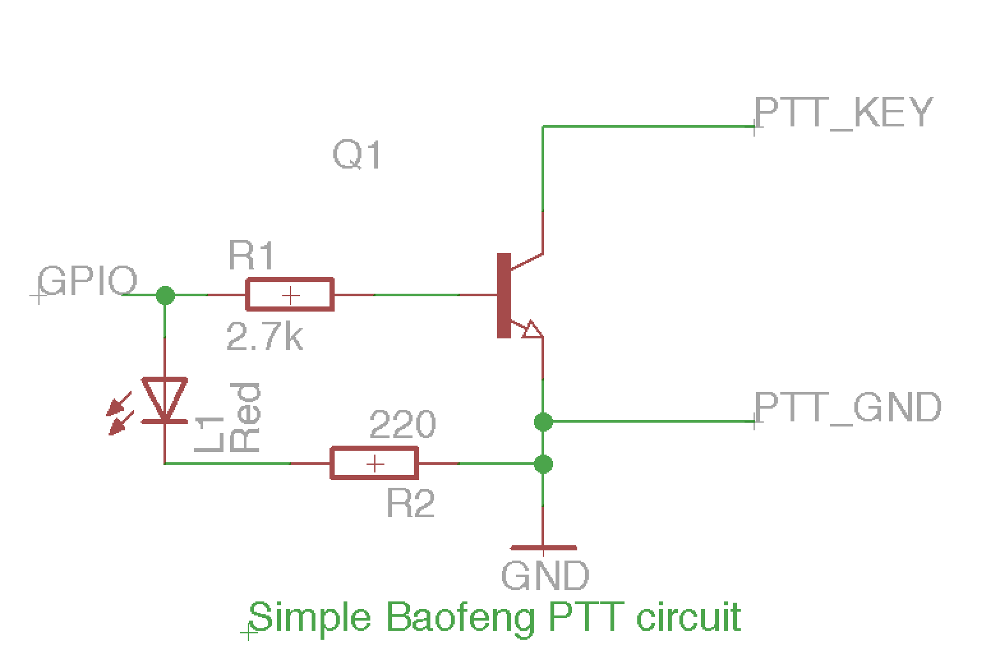

# Hardware

The software is compatible with Debian Linux and its derivatives, and Debian Linux 
can run on many devices. The objective of this setup is to be as compact and low power as possible. 
Devices which are known to be capable of running the software include: 

- Bare metal
    - Beaglebone black
    - Raspberry Pi 2B 
- Docker container with Debian-ish image
    - Odroid C2 (Running [ArchLinux ARM](https://archlinuxarm.org/))

Other boards which should work:

- CubieBoard
- Beaglebone green

The Raspberry Pi Zero (Running [HypriotOS](https://blog.hypriot.com/downloads/)) will run the map 
cache software inside a docker container, and will quite happily seed your map cache
for you. 

## Computer board

As mentioned above, pretty much any embedded computer that can run a current version of Linux will 
be good for this. My personal preference goes to the BeagleBone, though the CubieBoard's 
built-in sound card certainly sounds like a very interesting choice.

## Sound card

The sound card is usually the tricky part of those embedded computers. The BeagleBone does not have one, 
for instance. The CubieBoard does. The Raspberry Pi can talk but can't hear.

For this build, I elected to use the Beaglebone Audio cape (version 2). There are many things I find irritating with this sound card, and its drivers are very rough around the edges, but all in all, it does the job if you are careful. This doc describes how to make it work properly, and I spent quite a few hours doing that...

## PTT Switch

The last hardware part is a way to key your radio transceiver. This is actually very straightforward: if you look at the documentation of Direwolf (which is audio modem we are using), you can simply use GPIO lines on your BeagleBone with a simple transistor, and you're in business.

On this setup, I am using the following GPIOs:

- Connector P9 pin 14 (GPIO 50) : DCD Led. Lights up when Direwolf detects a radio carrier
- Connector P9 pin 16 (GPIO 51): PTT key. You will probably need a PNP transistor to key your radio, depending on the model

The schematics below show one very simple way of connecting a Kenwood/Baofeng style radio that requires grounding the PTT line to key it. The transistor can be a 2N2222 or similar:

You should use a ferrite choke on the line that goes from your radio mic/headphone plug to the sound card of your Beaglebone/Rapsberry Pi, to prevent spontaneous resets or other issues when the radio is transmitting. Though the risk is low with a well matched antenna, that sort of simple protection will prevent a lot of head scratching and frustration down the line.

An Open Hardware option from the Maker community is the 
[Raspberry Pi Radio Interface](https://github.com/jaymzx/RPi-WD-Packet-Interface). 
In spite of the name, it basically implements the recommended circuit in the Direwolf 
user manual. The board adapts headphone/microphone jacks to a standard Kantronics
DB-9 interface so you can buy make or re-use cables. The downside of this option is that you have to 
get the board made, then stuff it yourself.

## Optional components

One of the Beaglebone's great features is its ability to operate on USB power, which makes it a truly portable setup. But for general use, you might want to install a small WiFi USB dongle and turn it into a WiFi access point. More on this in the configuration section.
